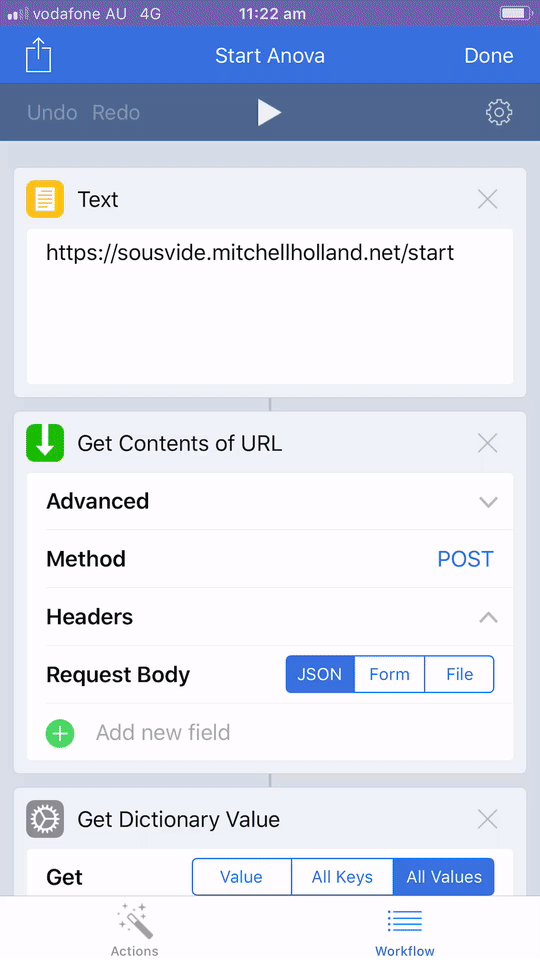
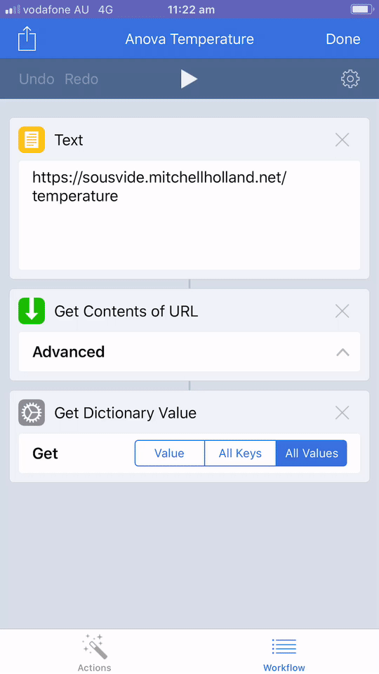

# TypeScript Web API for BLE Anova Precision Cooker

I use this to make my BLE-only [cooker](https://anovaculinary.com) available over the internet.

The cooker connects to my home server, over BLE, which runs this project, giving me control over the cooker from all the places.  
☁️👩‍🍳🍖

